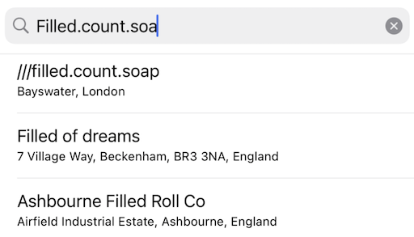

# &nbsp;Autosuggest Helper tutorial


Overview
--------

This is a tutorial for using W3WAutosuggestHelper to incorporate what3words into your existing autocomplete interface.



### Audience

This tutorial is intended for anyone that already has an autocomplete UI element in their app showing possible addresses in a `UITableView`.  It explains a method of adding what3words suggestions alongside your existing address results.

### Example

There is an example provided in the [Examples/AutosuggestPlusYourData/](../Examples/AutosuggestPlusYourData/AutosuggestPlusYourData.xcodeproj) folder of the API wrapper repository.  The example uses Apple's `MKLocalSearchCompleter` address autocompleter to provide standard address autocompletion, and it augments those results with wha3words suggestions using `autosuggest` in the manner described below.

#### Authentication
To use the what3words API you’ll need a what3words API key, which can be signed up for [here](https://what3words.com/select-plan).

#### Install Api Wrapper

Add the Swift Package at [https://github.com/what3words/w3w-swift-wrapper](https://github.com/what3words/w3w-swift-wrapper) to your project:

```
https://github.com/what3words/w3w-swift-wrapper.git
```

#### Add imports

At the top of your TableViewController add:

```Swift
import W3WSwiftApi
import CoreLocation
```

#### Add the helper to class variables
Add the api and helper wherever you put your class variables and **be sure to use your API key**:

```Swift
// instantiate the Helper by passing it a reference to the api
let autosuggest = W3WAutosuggestHelper(What3WordsV3(apiKey: "YourApiKey"))
```

#### Add autosuggest.update(text:)

Wherever you get updates about keystrokes, from your UISearchController, UITextField or other, add `autosuggest.update(text:)`.  For example if you are using a `UITextFieldDelegate`:

```
public func textField(_ textField: UITextField, shouldChangeCharactersIn range: NSRange, replacementString string: String) -> Bool {
  autosuggest.update(text: textField.text, options: W3WOption.focus(usersGpsLocation)) { error in
    // this completion block is called after the results are updated
    DispatchQueue.main.async {
      self.tableView.reloadData()
    }
  }
  
  // update your datasource however you do it
  updateyourAddressesData(text: text: textField.text)
}
```

The call to `autosuggest.update(text:options)` uses a debouncer so that it will limit calls to the API server to no more than about 3 per second.  This allows your user to type as fast as they want without flooding the conection.  The frequency can be changed (see the "fine tuning" section below).

#### Add another section to UITableView

Arguably, the easiest way to add what3words suggestions to your table is probably to add an additional "section" using `UITableViewDataSource`'s `numberOfSections`:

```
func numberOfSections(in tableView: UITableView) -> Int {
  return yourCurrentNumberOfSections + 1
}
```

#### Adjust tableView(numberOfRowsInSection:)

Use `autosuggest.getSuggestionCount()` to get the current count of suggestions.  You might make what3words section zero so it appears at the top.  It will only provide results if the text input is in the format "word.word.w", and by default it returns only 3 results (see the "fine tuning" section below).

```
func tableView(_ tableView: UITableView, numberOfRowsInSection section: Int) -> Int {

  // if this is for section zero, we return the number of what3words suggestions
  if section == 0 {
    return autosuggest.getSuggestionCount()
    
  // if this is section one we return the number of your data's suggestions
  } else if section == 1 {
    return yourDatasSearchResults.count
  }
     
  return 0
}
```

#### Get values from the suggestions for cellForRowAt:indexPath

Based on the section number, populate the `UITableViewCell` with either your data or a what3words suggestion:

```
func tableView(_ tableView: UITableView, cellForRowAt indexPath: IndexPath) -> UITableViewCell {
  let cell = UITableViewCell(style: .subtitle, reuseIdentifier: nil)

  // if this is a what3words suggestion row
  if indexPath.section == 0 {
    let suggestion = autosuggest.getSuggestion(row: indexPath.row)
    cell.textLabel?.text = "///" + (suggestion?.words ?? "")
    cell.detailTextLabel?.text = suggestion?.nearestPlace
        
  // if this is a row from your autocomplete values
  } else {
    cell.textLabel?.text = yourDataSearchReults.title
    cell.detailTextLabel?.text = yourDataSearchReults.subtitle
  }

  return cell
}
```

#### Get the coordinates once the user has selected a row

Once a user has selected a what3words suggestion row, you may want to call `autosuggest.selected(row:completion)` to get a `W3WSquare` containing all the information about the square including the (lat,lng) of it's center and bounds:

```
func tableView(_ tableView: UITableView, didSelectRowAt indexPath: IndexPath) {
  tableView.deselectRow(at: indexPath, animated: true)
  
  // a what3words row was selected
  if indexPath.section == 0 {
    autosuggest.selected(row: indexPath.row) { square, error in
	   print(square?.nearestPlace, square?.coordinates?.latitude, square?.coordinates?.latitude)
      doSomethingBasedOnWhatThreeWords(square: square)
    }
  
  // do your thing
  } else {
     doSomethingBasedOnYourData(row: indexPath.row)
  }
}
```

Note that `autosuggest.selected(row:completion)` calls `convertToCoordinates()` internally which may count against your plan's quota.


### Fine Tuning

##### Debouncer

If you prefer the API is called less frequently than every third of a second you can adjust the global variable `W3WSettings.defaultDebounceDelay`.  By default it is set to `0.3`.  For example:

```
W3WSettings.defaultDebounceDelay = 0.5
```

##### Options

You may pass options to `autosuggest.update(text:options:complete)`.  In the exmaple above we use `W3WOption.focus(CLLocationCoordinates2D)`.  Presuming your user is looking for an address relatively near to them, we ***strongly reccomend*** passing in thier current GPS location.  This provides most relevant and sorted results to the user.

We also provide various clip policies via options to allow you to filter by a geographic area. We recommend that you use the clipping to give a more targeted set of results to your user. You can clip by country, or by geographical box, circle or polygon.

You can also set the prefered langauge using options.

For complete documentation on available options, read the options [documentation](options.md).
 
If you place what3words suggestions as section zero, but don't want it displaying 3 results you can set the results count to a different number using the `W3WOptions`.  However, we ***strongly reccomend*** you use the default setting of 3 as our experience has shown this to be optimal.
