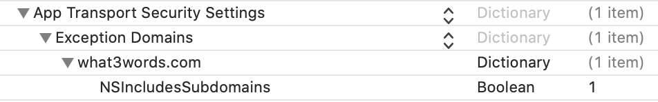

# &nbsp;w3w-swift-wrapper

A swift library to use the what3words [REST API](https://docs.what3words.com/api/v3/), and the what3words [VoiceAPI](https://developer.what3words.com/voice-api).

# Overview

The what3words Swift API wrapper gives you programmatic access to 

* convert a 3 word address to coordinates 
* convert coordinates to a 3 word address
* autosuggest functionality which takes a slightly incorrect 3 word address, and suggests a list of valid 3 word addresses
* obtain a section of the 3m x 3m what3words grid for a bounding box.
* determine the currently support 3 word address languages.
* autosuggest functionality to convert a spoken 3 word address (via voiceAPI) to a list of valid 3 word addresses

TLDR: You can find a short tutorial [here](Documentation/tutorial.md) that will show you how to get minimally set up and running.

# Authentication

To use this library you’ll need a what3words API key, which can be signed up for [here](https://what3words.com/select-plan).  If you wish to use the Voice API calls then you must add a Voice API plan to your [account](https://accounts.what3words.com/billing).

# Examples

There are four examples in this package:

#### iOS SwiftUI:
An iOS SwiftUI example using `autosuggest` is in this package at [Examples/AutoSuggest/AutoSuggest.xcodeproj](./Examples/AutoSuggest/AutoSuggest.xcodeproj)

#### macOS terminal:
A macOS terminal example demonstrating `convertToCoordinates` is at: [Examples/ConvertToCoords/ConvertToCoords.xcodeproj](./Examples/ConvertToCoords/ConvertToCoords.xcodeproj)

#### iOS UIKit Voice API:
An iOS UIKit example using the VoiceAPI is at: [Examples/VoiceAPI/VoiceAPI.xcodeproj](./Examples/VoiceAPI/VoiceAPI.xcodeproj)

#### iOS UIKit GridLine:
An iOS example using MapKit to show what3words gridlines on a map: [Examples/GridLines/GridLines.xcodeproj](./Examples/GridLines/GridLines.xcodeproj)

# Installation

#### Swift Package Manager

You can install this with [Swift Package Manager](https://developer.apple.com/documentation/xcode/adding_package_dependencies_to_your_app) by adding the URL below to Swift Packages under your project settings:

```
https://github.com/what3words/w3w-swift-wrapper.git
```

#### CocoaPods (iOS 9+, OS X 10.10+)

You can use CocoaPods to install w3w-swift-wrapper by adding it to the target in your Podfile:

```
pod 'W3WSwiftApi', :git => 'https://github.com/what3words/w3w-swift-wrapper.git'
```

#### Note:

Don't forget, if you are running on device you need to set the `App Transport Security Settings` in your `Info.plist` as you would any app communicating with a server:



Also, if you are using the Voice API on device, you should include Microphone permissions:


## Usage

### Import

In any swift file you use the what3words API, import the following:

```swift
import W3WSwiftApi
import CoreLocation
```

### Initialise

Use the following code with your API key to initialize the API:

```swift
let api = What3WordsV3(apiKey: "YourApiKey")
```
In the case that you run our Enterprise Suite API Server yourself, you may specifty the URL to your own server like so:

```swift
let api = What3WordsV3(apiKey: "YourApiKey", apiUrl: "https://api.yourserver.com")
```

Additionally, if you run the Enterprise Suite API Server there is another optional `setup()` parameter: `customHeaders`.  Use this if you need to send custom headers to your own server:

```swift
let api = What3WordsV3(apiKey: "YourApiKey", apiUrl: "https://api.yourserver.com", customHeaders: ["x-header-1":"value-1", "x-header-2":"value-2"])
```

## Functions

Each call takes a completion block as the last parameter. This allows Swift's trailing closure syntax to be used.  The closure's parameters contain the results.  If there was a problem with any call, it will be indicated by the [error object](#errors).

### Convert To 3 Word Address

Convert coordinates, expressed as latitude and longitude to a 3 word address.

This function takes the latitude and longitude as a [CLLocationCoordinate2D](https://developer.apple.com/documentation/corelocation/cllocationcoordinate2d) object 

The values returned from the `convertTo3wa` method are described in the [API documentation](https://docs.what3words.com/api/v3/#convert-to-3wa).

##### Code Example:

```swift
let coords = CLLocationCoordinate2D(latitude: 51.4243877, longitude: -0.34745)
api.convertTo3wa(coordinates: coords, language: "en") { square, error in
    print(square?.words ?? "")
}
```


### Convert To Coordinates

Convert a 3 word address to a position, expressed as coordinates of latitude and longitude.

This function takes the words parameter as a string of 3 words `'table.book.chair'`

The values returned from the `convertToCoordinates` method are described in the [API documentation](https://docs.what3words.com/api/v3/#convert-to-coords).

##### Code Example:
```swift
api.convertToCoordinates(words: "filled.count.soap") { square, error in
  print(square?.coordinates ?? "")
}
```

## AutoSuggest

Returns a list of 3 word addresses based on user input and other parameters.

This method provides corrections for the following types of input error:

* typing errors
* spelling errors
* misremembered words (e.g. singular vs. plural)
* words in the wrong order

The `autosuggest` method determines possible corrections to the supplied 3 word address string based on the probability of the input errors listed above and returns a ranked list of suggestions. This method can also take into consideration the geographic proximity of possible corrections to a given location to further improve the suggestions returned.

* voice

If you have a VoiceAPI enabled account, you may also call `autosuggest` with audio data for voice recognition.  In order for this to work, you must add a Voice API plan to [your account](https://accounts.what3words.com/billing).
  There is a minimal [example of this below](#voice-example), but detailed information can be found [here](Documentation/README.voiceAPI.md)

### Input 3 word address

You will only receive results back if the partial 3 word address string you submit contains the first two words and at least the first character of the third word; otherwise an error message will be returned.

We have prepared a regex, and example code to help you filter results before calling autosuggest.  Please see our [regex documentation](https://developer.what3words.com/tutorial/detecting-if-text-is-in-the-format-of-a-3-word-address)

### Clipping and Focus

We provide various `clip` policies to allow you to specify a geographic area that is used to exclude results that are not likely to be relevant to your users. We recommend that you use the clipping to give a more targeted, shorter set of results to your user. If you know your user’s current location, we also strongly recommend that you use the `focus` to return results which are likely to be more relevant.

In summary, the clip policy is used to optionally restrict the list of candidate `autosuggest` results, after which, if focus has been supplied, this will be used to rank the results in order of relevancy to the focus.

The values returned from the `autosuggest` method are described in the [what3words REST API documentation](https://developer.what3words.com/public-api/docs#autosuggest).

### Usage

The first parameter is the partial three words, or voice data.  The second optional parameter is the options for the autosuggest function.  The last parameter is the completion block.

#### Text Example One
```swift
api.autosuggest(text: "filled.count.soa") { (suggestions, error) in
  for suggestion in suggestions ?? [] {
    print("\(suggestion.words ?? "") is near \(suggestion.nearestPlace ?? "")")
  }
}
```

#### Text Example Two
Focus on one particular place

```swift
let coords = CLLocationCoordinate2D(latitude: 51.4243877, longitude: -0.34745)
api.autosuggest(text: "flottons.annulons.garço", options: W3WOption.focus(coords)) { (suggestions, error) in
  print(suggestions ?? "")
}
```


#### Text Example Three
Focus on (51.4243877,-0.34745) and ask for suggestions from a French three word fragment:
 
```swift
let coords = CLLocationCoordinate2D(latitude: 51.4243877, longitude: -0.34745)
let options = W3WOptions().focus(coords).clipToCountry("GB")
api.autosuggest(text: "flottons.annulons.garço", options: options) { (suggestions, error) in
  print(suggestions ?? "")
}
```


<a name="voice-example"></a>
#### VoiceAPI Example

The what3words Voice API allows a user to say three words into any application or service, with it returning a configurable list of what3words address suggestions, all through a single API call.

In order for this to work, you must add a Voice API plan to [your account](https://accounts.what3words.com/billing).

This example instantiates a `W3WMicrophone` which provides an audio stream to `autosuggest(audio:)` which begins recording when `autosuggest` is called.  For information on `W3WMicrophone` and customizing your own `W3WAudioStream` for `autosuggest(audio:)` see the [VoiceAPI README](Documentation/README.voiceAPI.md). 

```swift
// make a microphone
let microphone = W3WMicrophone()

// call autosuggest
api.autosuggest(audio: microphone, language: "en") { suggestions, error in
  for suggestion in suggestions ?? [] {
    print(suggestion.words ?? "no suggestions")
  }
}
```

Also, `W3WMicrophone` has a callback closure `W3WMicrophone.volumeUpdate: (Double) -> ()` that provides amplitude information useful for animating user feedback.  See the the [Voice API example](./Examples/VoiceAPI/VoiceAPI.xcodeproj), and more information is avialable in the [VoiceAPI README](Documentation/README.voiceAPI.md).

## Available Languages

This function returns the currently supported languages for text based `autosuggest(text:)` calls.  It will return the two letter code ([ISO 639](https://en.wikipedia.org/wiki/ISO_639)), and the name of the language both in that language and in English.

The values returned from the `convertTo3wa` method are described in the [what3words REST API documentation](https://docs.what3words.com/api/v3/#available-languages)

#### Code Example
```swift
api.availableLanguages() { (languages, error) in
  for language in languages ?? [] {
    print(language.code, language.name, language.nativeName)
  }
}
```

For the available Voice API langauges call `api.availableVoiceLanguages(completion:)` which works exactly the same way.

## Grid Section

Returns a section of the 3m x 3m what3words grid for a given area. The requested box must not exceed 4km from corner to corner, or a BadBoundingBoxTooBig error will be returned. Latitudes must be >= -90 and <= 90, but longitudes are allowed to wrap around 180. To specify a bounding-box that crosses the anti-meridian, use longitude greater than 180. Example value: 50.0, 179.995, 50.01, 180.0005. 

The values returned from the `gridSection` function are described in the [what3words REST API documentation](https://docs.what3words.com/api/v3/#grid-section)

#### Code Example
```swift
let southWest = CLLocationCoordinate2D(latitude: 52.208867, longitude: 0.117540)
let northEast = CLLocationCoordinate2D(latitude: 52.207988, longitude: 0.116126)

api.gridSection(southWest: southWest, northEast: northEast) { (lines, error) in
  print("Line count: ", lines?.count ?? "zero")
}
```

<a name="errors"></a>
## Handling Errors

All functions call the completion block with `error` as the second parameter.  All Swift what3words `error` types are of `enum` type and conform to [`CustomStringConvertible`](https://developer.apple.com/documentation/swift/customstringconvertible), so they can be used with `String(describing: error)`:

#### Code Example
```swift
api.convertTo3wa(coordinates: CLLocationCoordinate2D(latitude: 51.4243877, longitude: -0.34745)) { square, error in
  if let e = error {
    print(String(describing: e))
  } else {
    print(square?.words ?? "")
  }
}
```

Api call errors are of type `W3WError` enum and the voice `autosuggest` call returns a `W3WVoiceError` enum.
